# Database Schema Diagram

## Entity Relationship Diagram

```mermaid
erDiagram
    Users ||--o{ Survey_Jobs : "creates/owns"
    Survey_Jobs ||--o{ Property_Rooms : "has"
    Survey_Jobs ||--o{ Survey_Data : "contains"
    Survey_Jobs ||--o{ Repair_Costs : "includes"
    Survey_Jobs ||--o{ Land_Property_Checks : "requires"
    Survey_Jobs ||--o{ Certificates_Warranties : "needs"
    Survey_Jobs ||--o{ AI_Processing_Logs : "processed_by"
    Survey_Jobs ||--o{ Generated_Reports : "generates"
    Survey_Sections ||--o{ Survey_Data : "categorizes"

    Users {
        bigint id PK
        varchar email UK
        varchar password
        enum role "admin, surveyor, client"
        varchar name
        varchar phone
        timestamp created_at
        timestamp updated_at
    }

    Survey_Jobs {
        bigint id PK
        bigint client_id FK
        text property_address
        enum survey_level "level_2, level_3, level_3_plus, roof_report"
        enum status "pending, confirmed, in_progress, completed"
        enum payment_status "pending, paid, refunded"
        decimal total_cost
        timestamp created_at
        datetime scheduled_date
    }

    Survey_Sections {
        bigint id PK
        varchar name "e.g., Roof, External Walls, Electrical"
        enum survey_level "level_2, level_3, level_3_plus, roof_report"
        int order_index
        boolean is_active
    }

    Property_Rooms {
        bigint id PK
        bigint survey_job_id FK
        varchar room_name "e.g., Bedroom 1, Kitchen"
        varchar location
        enum orientation "front, rear, centre"
        text photos_observations
        timestamp created_at
    }

    Survey_Data {
        bigint id PK
        bigint survey_job_id FK
        bigint section_id FK
        varchar field_name "e.g., Roof1, ExternalWalls1"
        text field_value
        enum condition_rating "green, orange, red"
        json photos "array of image URLs"
        timestamp created_at
        timestamp updated_at
    }

    Repair_Costs {
        bigint id PK
        bigint survey_job_id FK
        enum category "essential, provisional, improvement"
        varchar element "e.g., Electricity Supply, Roof"
        text description
        varchar due_date "e.g., now, 2025, 2030"
        decimal estimated_cost
        timestamp created_at
    }

    Land_Property_Checks {
        bigint id PK
        bigint survey_job_id FK
        varchar check_item "e.g., Restrictive Covenants"
        enum status "pending, completed, not_applicable"
        text notes
        timestamp created_at
    }

    Certificates_Warranties {
        bigint id PK
        bigint survey_job_id FK
        varchar item "e.g., Electrical Certificate"
        enum status "required, obtained, not_required"
        text notes
        date expiry_date
        timestamp created_at
    }

    AI_Processing_Logs {
        bigint id PK
        bigint survey_job_id FK
        text input_data
        text ai_prompt_used
        text ai_response
        json condition_ratings_generated
        int processing_time
        timestamp created_at
    }

    Generated_Reports {
        bigint id PK
        bigint survey_job_id FK
        longtext report_content "HTML/JSON structured data"
        varchar pdf_url
        enum status "draft, final, delivered"
        timestamp created_at
        timestamp delivered_at
    }
```



## Database Schema Details

### 1. **Users Table**
Core authentication and user management table.

**Roles:**
- `admin`: Full system access
- `surveyor`: Can conduct surveys and generate reports
- `client`: Can request surveys and view reports

**Key Features:**
- Email must be unique
- Password is hashed
- Phone number for contact

---

### 2. **Survey_Jobs Table**
Central table that tracks all survey requests and their lifecycle.

**Survey Levels:**
- `level_2`: Basic survey
- `level_3`: Comprehensive survey
- `level_3_plus`: Extended comprehensive survey
- `roof_report`: Specialized roof inspection

**Status Flow:**
```
pending → confirmed → in_progress → completed
```

**Payment Status:**
```
pending → paid (or) → refunded
```

---

### 3. **Survey_Sections Table**
Template/configuration table for survey categories.

**Purpose:**
- Defines standardized sections for each survey level
- Maintains consistent structure across surveys
- Can be enabled/disabled with `is_active`
- `order_index` controls display order in forms/reports

**Examples of Sections:**
- Roof
- External Walls
- Windows, Frames & Cills
- Electrical Systems
- Plumbing
- Drainage
- etc.

---

### 4. **Property_Rooms Table**
Configuration of accommodation details.

**Purpose:**
- Documents room layout
- Links photos to specific rooms
- Tracks room orientation for context

**Orientation:**
- `front`: Street-facing
- `rear`: Back of property
- `centre`: Interior rooms

---

### 5. **Survey_Data Table**
Main data storage for survey observations.

**Structure:**
- Each field from the Excel spreadsheet becomes a row
- Flexible schema allows different fields per survey level
- AI generates `condition_rating` based on observations

**Condition Ratings:**
- 🟢 `green`: Good condition, no action needed
- 🟠 `orange`: Requires attention/monitoring
- 🔴 `red`: Critical issue, immediate action required

**Photos:**
Stored as JSON array:
```json
["url1.jpg", "url2.jpg", "url3.jpg"]
```

---

### 6. **Repair_Costs Table**
Summary of repair costs extracted from survey data.

**Categories:**
- `essential`: Must be done immediately
- `provisional`: Recommended within timeframe
- `improvement`: Optional upgrades

**Due Date Examples:**
- "now" - Immediate
- "2025" - Within 1 year
- "2030" - Within 5 years
- "ongoing" - Regular maintenance

---

### 7. **Land_Property_Checks Table**
Legal and environmental checks required.

**Common Check Items:**
- Restrictive Covenants
- Ground Stability Report
- Mining Report
- Flood Risk Assessment
- Environmental Searches
- Planning Permission Verification

---

### 8. **Certificates_Warranties Table**
Tracks required documentation and guarantees.

**Common Items:**
- Electrical Certificate (EICR)
- Gas Safety Certificate
- Roof Guarantees
- Window Warranties
- Damp Proof Course Certificates
- Building Regulation Certificates

---

### 9. **AI_Processing_Logs Table**
Audit trail for AI-generated content.

**Purpose:**
- Track what data was sent to AI
- Store prompts used for reproducibility
- Log responses for review
- Record condition ratings generated
- Monitor processing performance

**Use Cases:**
- Quality control
- Training data collection
- Performance optimization
- Debugging AI outputs

---

### 10. **Generated_Reports Table**
Final output of the survey process.

**Content Storage:**
- HTML/JSON format for web viewing
- PDF URL for downloadable version

**Status Flow:**
```
draft → final → delivered
```

**Features:**
- Tracks creation and delivery timestamps
- Can regenerate if needed
- Links to source Survey_Job for updates

---

## Key Relationships

### One-to-Many Relationships

1. **Users → Survey_Jobs**
   - A client can have multiple survey requests
   - Each survey belongs to one client

2. **Survey_Jobs → Property_Rooms**
   - One survey can document multiple rooms
   - Each room belongs to one survey

3. **Survey_Jobs → Survey_Data**
   - One survey has many data fields
   - Each data point belongs to one survey

4. **Survey_Sections → Survey_Data**
   - One section type can appear in many surveys
   - Each data field belongs to one section

5. **Survey_Jobs → Repair_Costs**
   - One survey generates multiple repair cost items
   - Each cost item belongs to one survey

6. **Survey_Jobs → Land_Property_Checks**
   - One survey requires multiple checks
   - Each check belongs to one survey

7. **Survey_Jobs → Certificates_Warranties**
   - One survey tracks multiple certificates
   - Each certificate belongs to one survey

8. **Survey_Jobs → AI_Processing_Logs**
   - One survey can have multiple AI processing runs
   - Each log belongs to one survey

9. **Survey_Jobs → Generated_Reports**
   - One survey can generate multiple report versions
   - Each report belongs to one survey

---

## Indexes Recommendations

For optimal performance, consider these indexes:

```sql
-- Users
INDEX idx_users_email (email)
INDEX idx_users_role (role)

-- Survey_Jobs
INDEX idx_survey_jobs_client_id (client_id)
INDEX idx_survey_jobs_status (status)
INDEX idx_survey_jobs_payment_status (payment_status)
INDEX idx_survey_jobs_scheduled_date (scheduled_date)

-- Survey_Data
INDEX idx_survey_data_job_id (survey_job_id)
INDEX idx_survey_data_section_id (section_id)
INDEX idx_survey_data_condition_rating (condition_rating)

-- Property_Rooms
INDEX idx_property_rooms_job_id (survey_job_id)

-- Repair_Costs
INDEX idx_repair_costs_job_id (survey_job_id)
INDEX idx_repair_costs_category (category)

-- Land_Property_Checks
INDEX idx_land_checks_job_id (survey_job_id)
INDEX idx_land_checks_status (status)

-- Certificates_Warranties
INDEX idx_certificates_job_id (survey_job_id)
INDEX idx_certificates_status (status)

-- AI_Processing_Logs
INDEX idx_ai_logs_job_id (survey_job_id)
INDEX idx_ai_logs_created_at (created_at)

-- Generated_Reports
INDEX idx_reports_job_id (survey_job_id)
INDEX idx_reports_status (status)
```

---

## Data Flow Overview

```
1. Client creates Survey_Job
   ↓
2. Surveyor conducts inspection
   ↓
3. Surveyor fills Property_Rooms (room layout)
   ↓
4. Surveyor fills Survey_Data (observations per section)
   ↓
5. AI processes Survey_Data
   ↓
6. AI generates condition_ratings (green/orange/red)
   ↓
7. AI logs processing in AI_Processing_Logs
   ↓
8. System extracts Repair_Costs from data
   ↓
9. System checks Land_Property_Checks requirements
   ↓
10. System verifies Certificates_Warranties
    ↓
11. System generates Generated_Reports (HTML + PDF)
    ↓
12. Report delivered to client
    ↓
13. Survey_Job marked as completed
```

---

## Storage Considerations

### File Storage Strategy

**Photos/Images:**
- Store in cloud storage (AWS S3, Cloudflare R2, etc.)
- Store URLs in database
- Organize by survey_job_id: `/surveys/{job_id}/photos/`

**PDF Reports:**
- Store in cloud storage
- Store URLs in `Generated_Reports.pdf_url`
- Organize by: `/surveys/{job_id}/reports/`

**Naming Convention:**
```
/surveys/12345/photos/room_kitchen_001.jpg
/surveys/12345/photos/roof_exterior_001.jpg
/surveys/12345/reports/survey_level3_final.pdf
```

---

## Backup Strategy

**Critical Tables (High Priority):**
- Users
- Survey_Jobs
- Survey_Data
- Generated_Reports

**Configuration Tables (Medium Priority):**
- Survey_Sections
- Certificates_Warranties
- Repair_Costs

**Logs (Low Priority):**
- AI_Processing_Logs (can be truncated after X months)

**Recommendation:**
- Daily backups of critical tables
- Weekly full database backup
- Retain backups for 6 months minimum
- Archive completed surveys older than 2 years

---

## Future Enhancements

**Potential Additional Tables:**

1. **Survey_Templates**
   - Store pre-built question templates
   - Link to Survey_Sections

2. **Notifications**
   - Track email/SMS notifications sent
   - Delivery status

3. **Payments**
   - Detailed payment transactions
   - Payment gateway logs
   - Refund tracking

4. **Comments/Notes**
   - Internal notes between admin/surveyor
   - Client questions/clarifications

5. **Document_Attachments**
   - Store additional client-provided documents
   - Certificates uploaded by client

6. **Survey_Revisions**
   - Version control for Survey_Data
   - Track changes over time

---

## Sample Data Relationships

```
User (Client)
  └── Survey_Job #1 (Level 3, Address: 123 Main St)
      ├── Property_Rooms
      │   ├── Living Room (Front)
      │   ├── Kitchen (Rear)
      │   └── Bedroom 1 (Front)
      ├── Survey_Data
      │   ├── Roof Section
      │   │   ├── Roof1: "Tiles showing wear..."
      │   │   └── Roof2: "Flashing needs repair..."
      │   └── Electrical Section
      │       └── Electrical1: "Consumer unit outdated..."
      ├── Repair_Costs
      │   ├── Roof flashing repair - £500 (Essential, Due: now)
      │   └── Electrical rewire - £3000 (Essential, Due: 2025)
      ├── Land_Property_Checks
      │   ├── Flood Risk: Completed
      │   └── Mining Report: Not Applicable
      ├── Certificates_Warranties
      │   ├── Electrical Certificate: Required
      │   └── Gas Safety: Obtained
      ├── AI_Processing_Logs
      │   └── Processed on 2024-01-15, 2.3s
      └── Generated_Reports
          └── Final Report (PDF) - Delivered 2024-01-16
```


